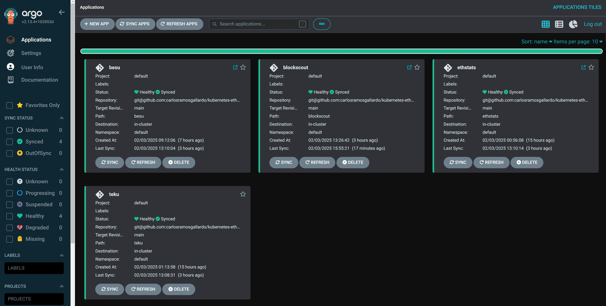
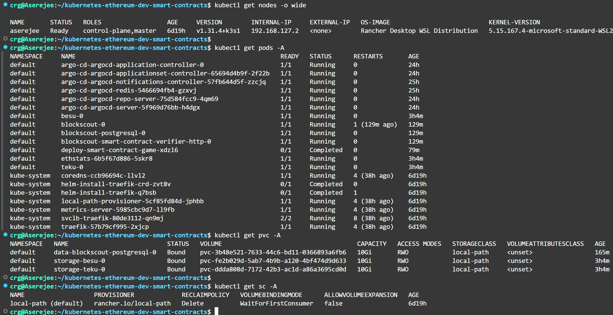
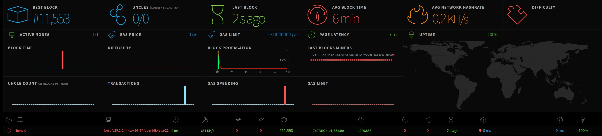
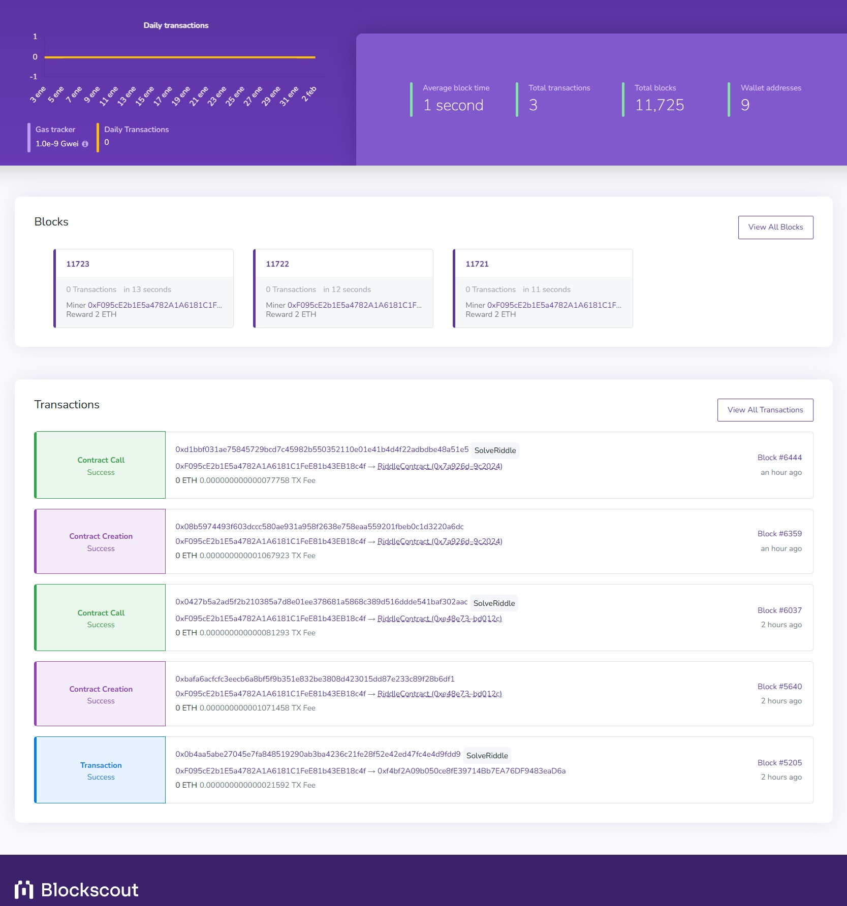
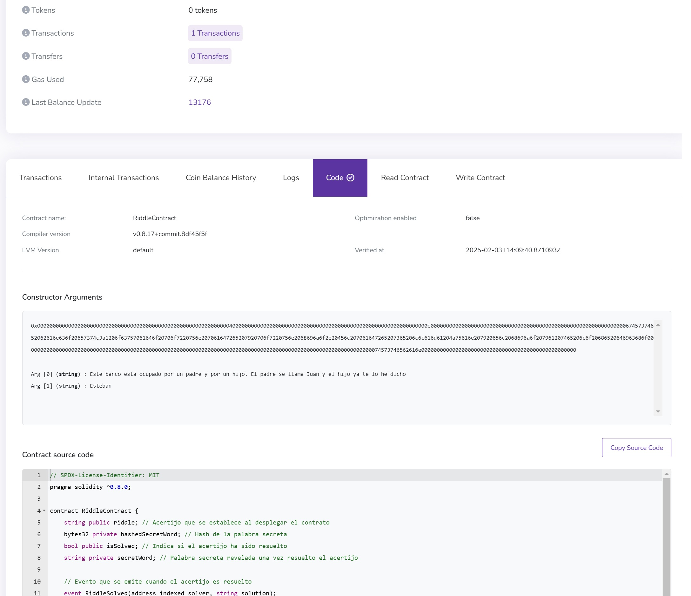

# Kubernetes Ethereum Dev & Smart Contracts 🚀

Welcome to **Kubernetes Ethereum Dev & Smart Contracts**! This project provides a fully automated deployment setup for Ethereum private networks using **Besu, Teku, BlockScout, EthStats**, and **Smart Contracts**, all orchestrated with **GitOps** via **ArgoCD**.

## 📌 GitOps with ArgoCD

Automate your deployments with **ArgoCD** for continuous integration and delivery:

Install ArgoCD:

```sh
helm upgrade --install argo-cd argo-cd/argo-cd -f ./argocd/values.yaml
curl -sSL -o argocd-linux-amd64 https://github.com/argoproj/argo-cd/releases/latest/download/argocd-linux-amd64
```

### Login to ArgoCD (http):

```sh
argocd login argocd.local --plaintext --grpc-web
Username: admin
Password: <your-password>
```

All services are automatically deployed by reading different directories from this repository:




Applying the deployment to my local environment using WSL with Rancher Desktop and Docker:




## 🛠️ **Manual Deployment**  

Add Helm Repositories:

```sh
helm repo add argo-cd https://argoproj.github.io/argo-helm
helm repo add ethereum-helm-charts https://ethpandaops.github.io/ethereum-helm-charts
```

Delete Previous Deployments:

```sh
helm delete blockscout
helm delete besu
helm delete teku
helm delete ethstats
kubectl delete pvc --all
```

Upgrade and Install the Services:

```sh
helm upgrade teku --install ethereum-helm-charts/teku -f ./teku/values.yaml
helm upgrade besu --install ethereum-helm-charts/besu -f ./besu/values.yaml
helm upgrade blockscout --install ethereum-helm-charts/blockscout -f ./blockscout/values.yaml
helm upgrade ethstats --install ethereum-helm-charts/ethstats -f ./ethstats/values.yaml
```

## 🔹 What is Besu?  

[Hyperledger Besu](https://www.hyperledger.org/use/besu) is an open-source Ethereum client designed for both public and private networks. It supports Ethereum Mainnet, private networks, and permissioned consortium networks. Besu enables smart contract execution, consensus mechanisms (such as IBFT and PoA), and full compatibility with Ethereum’s JSON-RPC APIs.


## 🔹 What is Teku?  

[Teku](https://consensys.net/teku) is an open-source Ethereum client developed by Consensys, designed specifically for Ethereum’s Proof-of-Stake consensus (Ethereum Beacon Chain). It enables users to run Ethereum validators, participate in staking, and interact with the Ethereum 2.0 network using the Beacon Chain API.

## 🔹 What is EthStats?  

[EthStats](https://github.com/Alethio/ethstats-network) is a real-time Ethereum network monitoring tool that provides insights into node performance, block propagation, and overall network health. It allows users to visualize blockchain statistics such as block times, transaction counts, and peer connections in an interactive dashboard.



## 🔹 What is BlockScout?  

[BlockScout](https://blockscout.com/) is an open-source blockchain explorer that provides detailed insights into Ethereum and EVM-compatible networks. It allows users to search for transactions, addresses, blocks, and smart contracts, offering a user-friendly interface to interact with on-chain data.



## ♻️ **Deploying Smart Contracts**

Deploy Smart Contract:

```sh
kubectl delete -f smart-contract-deployer/jobs/smart-contract.yaml \
    -f smart-contract-deployer/configmaps/smart-contract.yaml \
    -f smart-contract-deployer/configmaps/deploy.yaml

kubectl create -f smart-contract-deployer/jobs/smart-contract.yaml \
    -f smart-contract-deployer/configmaps/smart-contract.yaml \
    -f smart-contract-deployer/configmaps/deploy.yaml
```

Extract Contract Address from Logs:

```sh
kubectl logs deploy-smart-contract-game-2b9hg -f
```

Sample Output:

```sh
Copiando MyContract.sol...
Compilando smart contracts...
Desplegando contrato...
Contrato desplegado en: 0xe48e7354683Eb7BE9a7418D24D8670a568bD012c
```

In BlockScout, you can visually view the contract generated by the Kubernetes Job, which uses the configMaps containing the deployment script and the smart contract:


## 🧪 **Testing Smart Contracts**

Install Dependencies:

```sh
npm install --save-dev @nomiclabs/hardhat-ethers ethers
```

Compile Contracts:

```sh
npx hardhat compile
```

Test Contract Execution:

```sh
npx hardhat run tests/solveRiddle.js --network development
⏳ Intentando resolver el acertijo con: 'palabraSecreta'
❌ Error al intentar resolver el acertijo: Execution reverted: Respuesta incorrecta.
```

When the secret word is entered, a transaction is triggered where the variable change is recorded:


```sh
npx hardhat run tests/solveRiddle.js --network development
⏳ Intentando resolver el acertijo con: 'Esteban'
⏳ Verificando si el acertijo fue resuelto...
Estado de isSolved después de intentar resolver: true
✅ ¡Acertijo resuelto correctamente!
```

When the contract is verified, for example, from the BlockScout portal (with the verifier activated and knowledge of the contract and some compilation data, etc.), features such as "Read Contract" or "Write Contract" are enabled, allowing you to view the contract code.



```sh
npx hardhat run tests/solveRiddle.js --network development
⏳ Intentando resolver el acertijo con: 'Esteban'
❌ Error al intentar resolver el acertijo: Execution reverted: El acertijo ya ha sido resuelto.
```


## 🔧 **Tools**

Create a New Wallet:

```sh
node tools/createWallet.js
```

Sample Output:

```sh
Address: 0xCe9CCcF85...
Private Key: 0xf7e69b...
```


## 🏗️ **Build Smart Contract Deployer Image**

```sh
docker build -t smart-contract-deployer:1.0 -f ./smart-contract-deployer-image/Dockerfile ./smart-contract-deployer-image
```


🚀 Now you're ready to deploy and interact with Ethereum on Kubernetes! 🎉

