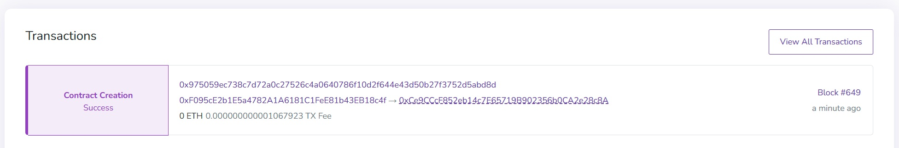

# Kubernetes Ethereum Dev & Smart Contracts 🚀

Welcome to **Kubernetes Ethereum Dev & Smart Contracts**! 
This project provides a fully automated deployment setup for Ethereum private networks using **Besu, Teku, BlockScout, EthStats**, and **Smart Contracts**.


 **Repository Structure**
This repository is organized into the following directories:

📂 **`argocd/`** - Configuration for managing deployments using **ArgoCD**.  
📂 **`artifacts/`** - Compiled artifacts for smart contracts and other build outputs.  
📂 **`besu/`** - Helm chart and configurations for deploying the **Besu** execution client.  
📂 **`blockscout/`** - Helm chart and settings for deploying **BlockScout**, an Ethereum block explorer.  
📂 **`cache/`** - Temporary storage for compiled smart contracts and dependencies.  
📂 **`contracts/`** - Solidity smart contract source code.  
📂 **`course/`** - **Course Guide** and structured materials for learning Kubernetes and Ethereum.  
📂 **`deploys/`** - Helm charts and Kubernetes manifests for managing deployments.  
📂 **`ethstats/`** - Helm configuration for deploying **EthStats**, a network monitoring tool.  
📂 **`images/`** - Docker images and custom scripts for smart contract deployment.  
📂 **`node_modules/`** - Dependencies managed by **Node.js** for smart contract development.  
📂 **`smart-contract-deployer/`** - Scripts and configurations for deploying smart contracts in Kubernetes.  
📂 **`smart-contract-deployer-image/`** - Dockerfiles for building contract deployment images.  
📂 **`teku/`** - Helm chart and configurations for **Teku**, the Ethereum consensus client.  
📂 **`tests/`** - Test scripts for interacting with deployed smart contracts.  
📂 **`tools/`** - Utility scripts for working with Ethereum keys, contracts, and deployments.  

📄 **`README.md`** - This document.  
📄 **`hardhat.config.js`** - Configuration for **Hardhat**, the Ethereum development environment.  
📄 **`package.json`** / **`package-lock.json`** - Node.js dependencies and scripts for smart contract development.  

---

For a deeper dive into the setup, configurations, and hands-on exercises, check out the **[full course here](course/guide.md)**.

---

📌 **GitOps (ArgoCD & GitHub)**

Automate your deployments with ArgoCD for continuous integration and delivery:

Install ArgoCD:

```sh
helm upgrade --install argo-cd argo-cd/argo-cd -f ./argocd/values.yaml
curl -sSL -o argocd-linux-amd64 https://github.com/argoproj/argo-cd/releases/latest/download/argocd-linux-amd64
```

Login to ArgoCD (http):

```sh
argocd login argocd.local --plaintext --grpc-web
````
```sh
Username: admin
Password: <your-password>
```

All services are automatically deployed by reading different directories from this repository:


Applying the deployment to my local environment using **WSL** with **Rancher Desktop** and **Docker**:


```sh
crg@Aserejee:~/kubernetes-ethereum-dev-smart-contracts$ kubectl get nodes -o wide
NAME       STATUS   ROLES                  AGE    VERSION        INTERNAL-IP     EXTERNAL-IP   OS-IMAGE                           KERNEL-VERSION                       CONTAINER-RUNTIME
aserejee   Ready    control-plane,master   7d4h   v1.31.4+k3s1   192.168.127.2   <none>        Rancher Desktop WSL Distribution   5.15.167.4-microsoft-standard-WSL2   docker://26.1.5

crg@Aserejee:~/kubernetes-ethereum-dev-smart-contracts$ kubectl get pods
NAME                                                        READY   STATUS      RESTARTS      AGE
argo-cd-argocd-application-controller-0                     1/1     Running     0             33h
argo-cd-argocd-applicationset-controller-65694d4b9f-2f22b   1/1     Running     0             33h
argo-cd-argocd-notifications-controller-57fb644d5f-zzcjq    1/1     Running     0             34h
argo-cd-argocd-redis-5466694fb4-gzxvj                       1/1     Running     0             34h
argo-cd-argocd-repo-server-75d584fcc9-4qm69                 1/1     Running     0             33h
argo-cd-argocd-server-5f969d76bb-h4dgx                      1/1     Running     0             33h
besu-0                                                      1/1     Running     0             11h
blockscout-0                                                1/1     Running     1 (11h ago)   11h
blockscout-postgresql-0                                     1/1     Running     0             11h
blockscout-smart-contract-verifier-http-0                   1/1     Running     0             11h
deploy-smart-contract-game-xdzl6                            0/1     Completed   0             10h
ethstats-6b5f67d886-5skr8                                   1/1     Running     0             11h
teku-0                                                      1/1     Running     0             11h

crg@Aserejee:~/kubernetes-ethereum-dev-smart-contracts$ kubectl get ing
NAME                    CLASS     HOSTS              ADDRESS         PORTS   AGE
argo-cd-argocd-server   traefik   argocd.local       192.168.127.2   80      33h
besu                    traefik   besu.local         192.168.127.2   80      11h
blockscout              traefik   blockscout.local   192.168.127.2   80      11h
ethstats                traefik   ethstats.local     192.168.127.2   80      11h

crg@Aserejee:~/kubernetes-ethereum-dev-smart-contracts$ kubectl get svc
NAME                                               TYPE        CLUSTER-IP      EXTERNAL-IP   PORT(S)                                                   AGE
argo-cd-argocd-applicationset-controller           ClusterIP   10.43.158.12    <none>        7000/TCP                                                  34h
argo-cd-argocd-redis                               ClusterIP   10.43.128.127   <none>        6379/TCP                                                  34h
argo-cd-argocd-repo-server                         ClusterIP   10.43.25.202    <none>        8081/TCP                                                  34h
argo-cd-argocd-server                              ClusterIP   10.43.136.198   <none>        80/TCP,443/TCP                                            34h
besu                                               ClusterIP   10.43.185.194   <none>        30303/TCP,30303/UDP,8545/TCP,8546/TCP,8551/TCP,9545/TCP   11h
besu-headless                                      ClusterIP   None            <none>        30303/TCP,30303/UDP,8545/TCP,8546/TCP,8551/TCP,9545/TCP   11h
blockscout                                         ClusterIP   10.43.62.75     <none>        4000/TCP                                                  11h
blockscout-headless                                ClusterIP   None            <none>        4000/TCP                                                  11h
blockscout-postgresql                              ClusterIP   10.43.104.99    <none>        5432/TCP                                                  11h
blockscout-postgresql-hl                           ClusterIP   None            <none>        5432/TCP                                                  11h
blockscout-smart-contract-verifier-http            ClusterIP   10.43.12.0      <none>        8050/TCP                                                  11h
blockscout-smart-contract-verifier-http-headless   ClusterIP   None            <none>        8050/TCP                                                  11h
ethstats                                           ClusterIP   10.43.64.185    <none>        3000/TCP                                                  11h
kubernetes                                         ClusterIP   10.43.0.1       <none>        443/TCP                                                   7d4h
teku                                               ClusterIP   10.43.47.109    <none>        9000/TCP,9000/UDP,5051/TCP,8008/TCP                       11h
teku-headless                                      ClusterIP   None            <none>        9000/TCP,9000/UDP,5051/TCP,8008/TCP                       11h

crg@Aserejee:~/kubernetes-ethereum-dev-smart-contracts$ kubectl get sc
NAME                   PROVISIONER             RECLAIMPOLICY   VOLUMEBINDINGMODE      ALLOWVOLUMEEXPANSION   AGE
local-path (default)   rancher.io/local-path   Delete          WaitForFirstConsumer   false                  7d4h

crg@Aserejee:~/kubernetes-ethereum-dev-smart-contracts$ kubectl get pvc
NAME                           STATUS   VOLUME                                     CAPACITY   ACCESS MODES   STORAGECLASS   VOLUMEATTRIBUTESCLASS   AGE
data-blockscout-postgresql-0   Bound    pvc-f89f7b59-5fe7-453c-b77e-11a88eec9861   10Gi       RWO            local-path     <unset>                 40m
storage-besu-0                 Bound    pvc-949cce87-d951-4aac-8a27-c3f92f9b5292   10Gi       RWO            local-path     <unset>                 41m
storage-teku-0                 Bound    pvc-0c51147d-b961-4057-a454-70489a12934c   10Gi       RWO            local-path     <unset>                 40m
```

---

🛠️ **Manual Deployment**  

Add Helm Repositories:

```sh
helm repo add argo-cd https://argoproj.github.io/argo-helm
helm repo add ethereum-helm-charts https://ethpandaops.github.io/ethereum-helm-charts
```

Delete Previous Deployments:

```sh
helm delete blockscout
helm delete besu
helm delete teku
helm delete ethstats
kubectl delete pvc --all
```

Upgrade and Install the Services:

```sh
helm upgrade teku --install ethereum-helm-charts/teku -f ./teku/values.yaml
helm upgrade besu --install ethereum-helm-charts/besu -f ./besu/values.yaml
helm upgrade blockscout --install ethereum-helm-charts/blockscout -f ./blockscout/values.yaml
helm upgrade ethstats --install ethereum-helm-charts/ethstats -f ./ethstats/values.yaml
```

---

🔹 **What is Besu?**  

[Hyperledger Besu](https://www.hyperledger.org/use/besu) is an open-source Ethereum client designed for both public and private networks. It supports Ethereum Mainnet, private networks, and permissioned consortium networks. Besu enables smart contract execution, consensus mechanisms (such as IBFT and PoA), and full compatibility with Ethereum’s JSON-RPC APIs.


🔹 **What is Teku?**  

[Teku](https://consensys.net/teku) is an open-source Ethereum client developed by Consensys, designed specifically for Ethereum’s Proof-of-Stake consensus (Ethereum Beacon Chain). It enables users to run Ethereum validators, participate in staking, and interact with the Ethereum 2.0 network using the Beacon Chain API.


🔹 **What is EthStats?**

[EthStats](https://github.com/Alethio/ethstats-network) is a real-time Ethereum network monitoring tool that provides insights into node performance, block propagation, and overall network health. It allows users to visualize blockchain statistics such as block times, transaction counts, and peer connections in an interactive dashboard.


🔹 **What is BlockScout?**

[BlockScout](https://blockscout.com/) is an open-source blockchain explorer that provides detailed insights into Ethereum and EVM-compatible networks. It allows users to search for transactions, addresses, blocks, and smart contracts, offering a user-friendly interface to interact with on-chain data.


---

🏗️ **Build Smart Contract Deployer Image**

```sh
docker build -t smart-contract-deployer:1.0 -f ./smart-contract-deployer-image/Dockerfile ./smart-contract-deployer-image
```

---

♻️ **Deploying Smart Contracts**

Deploy Smart Contract:

```sh
kubectl delete -f smart-contract-deployer/jobs/smart-contract.yaml \
    -f smart-contract-deployer/configmaps/smart-contract.yaml \
    -f smart-contract-deployer/configmaps/deploy.yaml
```

```sh
kubectl create -f smart-contract-deployer/jobs/smart-contract.yaml \
    -f smart-contract-deployer/configmaps/smart-contract.yaml \
    -f smart-contract-deployer/configmaps/deploy.yaml
```

Extract Contract Address from Logs:

```sh
kubectl logs deploy-smart-contract-game-2b9hg -f
```
```sh
Copiando MyContract.sol...
Copiando deploy.js...
Compilando smart contracts...
Downloading compiler 0.8.17
Downloading compiler 0.8.17
Compiled 1 Solidity file successfully (evm target: london).
Desplegando smart contract...
Desplegando contratos con la cuenta: 0xF095cE2b1E5a4782A1A6181C1FeE81b43EB18c4f
Saldo de la cuenta: 1296000000000000000000
Desplegando contrato...
Contrato desplegado en: 0xCe9CCcF852eb14c7E65719B902356b0CA2e28c8A
hardhat finalizado
Despliegue finalizado.
```

In BlockScout, you can visually view the contract generated by the Kubernetes Job, which uses the configMaps containing the deployment script and the smart contract:



---

🧪 **Testing Smart Contracts**

Install Dependencies:

```sh
npm install --save-dev @nomiclabs/hardhat-ethers ethers
```

Compile Contracts:

```sh
npx hardhat compile
```

Test Contract Execution:

```sh
export CONTRACT_ADDRESS=0xCe9CCcF852eb14c7E65719B902356b0CA2e28c8A
npx hardhat run tests/solveRiddle.js --network development
```

```sh
⏳ Intentando resolver el acertijo con: 'Aserejee?'
❌ Error al intentar resolver el acertijo: Execution reverted: Respuesta incorrecta.
```

When the secret word is entered, no transaction is triggered.

```sh
npx hardhat run tests/solveRiddle.js --network development
```

```sh
⏳ Intentando resolver el acertijo con: 'Esteban'
⏳ Verificando si el acertijo fue resuelto...
Estado de isSolved después de intentar resolver: true
✅ ¡Acertijo resuelto correctamente!
```

When the secret word is correct, the corresponding variable is set to true. The contract has not been verified yet:


```sh
npx hardhat run tests/solveRiddle.js --network development
```

Game over:

```sh
⏳ Intentando resolver el acertijo con: 'Esteban'
❌ Error al intentar resolver el acertijo: Execution reverted: El acertijo ya ha sido resuelto.
```

The smart contract can be verified from the BlockScout portal if the verifier has been enabled:


Features such as "Read Contract" or "Write Contract" are enabled, allowing you to view the contract code.


---

🔧 **Tools**

Create a New Wallet:

```sh
node tools/createWallet.js
```

Sample Output:

```sh
Address: 0xCe9CCcF85...
Private Key: 0xf7e69b...
```

---

🚀 Now you're ready to deploy and interact with Ethereum on Kubernetes! 🎉
